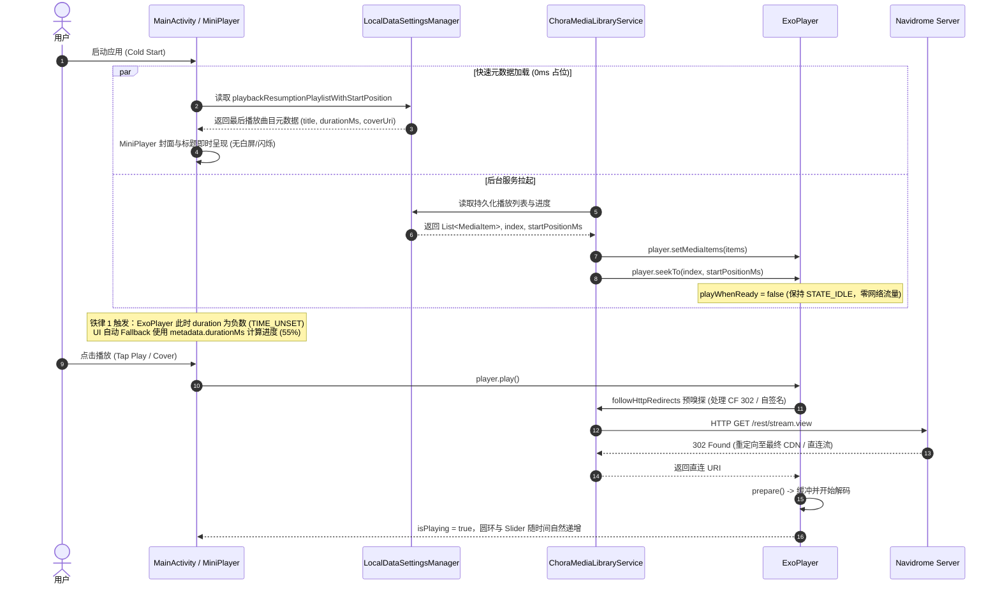

# Chora 架构全景与技术实现手册

本文档面向所有参与 Chora 客户端开发维护的工程师与 AI Agent，全面解析核心数据流、底层播放架构、网络音频嗅探机制以及关键模块交互。

---

## 1. 核心技术栈与拓扑

- **开发语言**：Kotlin 2.0+ (100%)
- **UI 框架**：Jetpack Compose + Material Design 3 (含 Compose Expressive 动效)
- **播放内核**：AndroidX Media3 1.5+ (ExoPlayer + MediaLibraryService + MediaSession)
- **网络与流媒体**：OkHttp3 + Retrofit2 + Subsonic REST 协议 (Navidrome)
- **本地持久化**：Jetpack Preferences DataStore (`LocalDataSettingsManager`, `AppearanceSettingsManager`)
- **图片加载与色彩提取**：Coil 2.x + AndroidX Palette (动态模糊与自适应背景色)
- **TV 端适配**：AndroidX Compose for TV (D-Pad 十字键焦点控制)

---

## 2. 播放状态机与冷启动续播架构 (Resumption Dataflow)



---

## 3. 核心机制深入解析

### 3.1 进度计算与多级 Fallback 防御体系
冷启动恢复或未缓冲阶段，ExoPlayer 处于 `Player.STATE_IDLE`，此时调用 `player.duration` 将返回 `C.TIME_UNSET`（负大数）。

```kotlin
// 1. 从 MediaMetadata 提取安全时长
val metaDurationMs = remember(metadata) {
    val ms = metadata?.durationMs ?: 0L
    if (ms > 0L) ms
    else (metadata?.extras?.getLong("duration")?.takeIf { it > 0 }?.times(1000L)) ?: 0L
}

// 2. 多级有效时长计算
val effectiveDuration = when {
    duration > 1000L -> duration
    metaDurationMs > 1000L -> metaDurationMs
    else -> 0L
}

// 3. 安全比例计算 (分母为 0 时安全落至 0f，严禁单纯 coerceAtLeast(1L))
val progress = if (effectiveDuration > 0L) {
    (currentPosition.toFloat() / effectiveDuration.toFloat()).coerceIn(0f, 1f)
} else {
    0f
}
```

### 3.2 Cloudflare / 反向代理 302 嗅探机制 (`followHttpRedirects`)
在某些公网部署（如使用 Cloudflare Tunnel、双重域名、反向代理端口映射）中，Subsonic 流请求返回 `302 Found` 跳转至其他端口或协议。Android 的默认网络栈安全沙箱会在跨协议跨端口时阻断自动重定向。

- **实现位置**：`ChoraMediaLibraryService.kt`
- **执行逻辑**：在把 URI 交付 ExoPlayer 之前，通过轻量级 `HttpURLConnection` 发送 `HEAD/GET` 探测，若响应码为 `301/302/303/307/308`，解析 `Location` 头并在白名单限制内多级迭代，将最终地址注入 `MediaItem.Uri`。

### 3.3 系统返回键 (BackHandler) 分层控制
在单 Activity 多 Composable 路由体系中，播放器全屏展开态必须优先拦截返回键：
1. **展开态优先**：`enabled = isPlayerExpanded`
   - 若播放队列展开 -> 关闭队列
   - 若歌曲详情展开 -> 关闭详情
   - 否则 -> 平滑执行 `scaffoldState.bottomSheetState.partialExpand()` 折叠为 Mini Player
2. **收起态控制**：`enabled = !isPlayerExpanded`
   - 若当前位于首页 (`Screen.Home.route`) -> 2 秒内双击退出应用并保存持久化状态
   - 若位于其他子页面 -> 正常 `navController.popBackStack()`
### 3.4 歌词翻译与双语对照体系 (Lyrics Translation)
对接 Navidrome 扩展 Native REST API (`/api/lyrics/translate`)，实现毫秒级双语歌词逐行同步：
1. **自动缓存探测**：播放 Navidrome 歌曲时，后台协程异步调用 `GET /api/lyrics/translate/{songId}?lang=zh-CN` 嗅探服务端永久缓存。若命中，点亮「译」图标小圆点。
2. **交互行为契约**：
   - **单击「译」**：若已有翻译则秒切双语对照（原文大字 + 译文小字）/ 仅原文；若无翻译则触发 `POST /api/lyrics/translate`。
   - **长按「译」**：携带 `"force": true` 强制唤起服务端 AI 重新翻译并覆盖展示。
3. **数据渲染一致性**：通过 `Lyric(startMs, text = listOf(original, translation))` 结构，天然与 `NowPlayingLyrics.kt` 多行透明度渲染引擎无缝衔接。

### 3.5 Jukebox 多输出设备与四大铁律 (Remote Output Manager)
服务端扩展多输出设备管理器（DeviceManager），支持局域网 MPD、DLNA UPnP 渲染器、小米小爱音箱原生协议：
- **铁律 1（0 音量容错与 3 秒防抢手）**：DLNA/MPD 唤醒初次回报音量常为 0，客户端接收到 0 时坚决丢弃；用户拖动音量滑块 200ms 防抖，松手后 3 秒内屏蔽远端状态覆盖本地滑块。
- **铁律 2（本地静音与时钟驱动）**：切换为远程音箱时，本地 ExoPlayer 设为 `player.volume = 0f`，保持 `playWhenReady = true`，锁屏与通知栏 `MediaSession`、桌面微件完美保活。
- **铁律 3（协议能力动态降级）**：当 `deviceType == "xiaomi"` 时，原生协议无进度回报且不支持 seek，UI 进度条禁用拖拽并给出轻量友好提示。
- **铁律 4（无缝流转带进度）**：切换到远程时携带当前本地播放秒数 `position`；切回本机时调用 `POST /api/jukebox/select` (`"browser"`)，本地播放器恢复音量出声。

---

## 4. 目录结构索引

```
app/src/main/java/com/craftworks/music/
├── MainActivity.kt                      # 全局入口、Scaffold 与多层返回键控制
├── managers/
│   ├── NavidromeManager.kt              # Navidrome 节点发现、测速选路与鉴权
│   ├── JukeboxManager.kt                # Jukebox 多输出设备调度与状态机 (遵守四大铁律)
│   ├── settings/
│   │   ├── LocalDataSettingsManager.kt  # 播放历史、歌单续播状态持久化
│   │   └── AppearanceSettingsManager.kt # 界面主题、动效风格配置
├── player/
│   ├── MusicService.kt                  # ChoraMediaLibraryService 核心播放服务 (Jukebox 控制转发)
│   └── AudioOutputObserver.kt           # 耳机拔插、蓝牙音频设备路由监听
├── data/
│   ├── datasource/navidrome/
│   │   ├── NavidromeDataSource.kt       # Subsonic 协议实现
│   │   └── NavidromeNativeApi.kt        # Navidrome Native REST API (Bearer 握手/翻译/Jukebox)
│   ├── model/
│   │   ├── Song.kt                      # 歌曲模型与 MediaItem/MediaMetadata 互转
│   │   ├── LyricsTranslationModel.kt    # 歌词翻译响应与行数据契约
│   │   └── JukeboxModel.kt              # 多设备输出契约
│   └── repository/
│       └── LyricsRepository.kt          # 歌词拉取、缓存探测、翻译切换中枢
└── ui/
    ├── elements/dialogs/
    │   └── JukeboxDeviceBottomSheet.kt  # 输出设备选择与远程音量调节浮层
    ├── playing/
    │   ├── NowPlayingMiniPlayer.kt      # 底部自适应浮层、圆形封面进度环
    │   ├── NowPlayingPortrait.kt        # 竖屏全屏播放、封面歌词双页联动、输出端入口
    │   ├── NowPlayingLandscape.kt       # 横屏分栏全屏播放
    │   ├── NowPlayingLyrics.kt          # 滚动歌词视轨、双语原文大字+译文小字、浮动译按钮
    │   └── NowPlayingElements.kt        # 播放控制按钮、OutputDeviceButton、滑块组件
    └── screens/                         # 各功能一级与二级屏幕
```

---

## 5. Navidrome 原生扩展 API 契约与避坑指南

Navidrome 扩展功能（Jukebox 多输出设备与歌词翻译）通过服务端的原生 Go 路由（`nativeapi`）提供支持。客户端必须严格遵循服务端的字段命名与序列化规范：

### 5.1 字段命名规范对照 (重大避坑警示)

| 业务模块 | 接口 | 关键字段名 | 字段大小写 | 序列化注解必须 | 踩坑后果 |
| :--- | :--- | :--- | :--- | :--- | :--- |
| **Jukebox 选择设备** | `POST /api/jukebox/select` | `device_id` | **snake_case** | `@SerialName("device_id")` | 若误传 camelCase `deviceId`，Go 会解码成空串 `""`，服务端回退为 `browser` 且返回 200，导致设备无法切换且后续播放报错 |
| **Jukebox 播放曲目** | `POST /api/jukebox/play` | `song_id`, `stream_url`, `position` | **snake_case** | `@SerialName("song_id")` | 若误传 camelCase `songId`，Go 解析为空串，报错 `HTTP 400: either song_id or stream_url is required` |
| **Jukebox 设备状态** | `GET /api/jukebox/status` | `currentTime`, `duration`, `volume`, `deviceId`, `deviceType` | **camelCase** | 保持与响应字段完全一致 | 注意与请求体 snake_case 区分 |
| **歌词翻译请求** | `POST /api/lyrics/translate` | `songId`, `targetLang`, `force` | **camelCase** | 无需额外下划线转换 | 与 Jukebox 请求格式不同，设计上使用驼峰命名 |

### 5.2 鉴权机制与 401 自动重试
- **Token 交换**：客户端使用用户凭据调用 `POST /auth/login` 获取 Bearer JWT Token。
- **并发保护**：在 `NavidromeNativeApi.kt` 中使用 `loginMutex.withLock`，防止多协程并发刷新 Token 导致令牌风暴。
- **双重请求头**：请求必须同时注入 `Authorization: Bearer <token>` 与 `X-ND-Authorization: Bearer <token>`，以兼容各类反向代理中间件。
- **401 自动愈合**：捕获 `HttpStatusCode.Unauthorized` 时，自动强制 `forceRefresh = true` 重新握手并透明重发原始请求。

---

## 6. 疑难排查与诊断手册 (Troubleshooting)

### 6.1 输出设备切换后仍显示“本机（Browser）”
1. **排查日志**：过滤 `JUKEBOX:V`。检查 `selectJukeboxDevice` 发送的 payload 是否为 `{"device_id":"<id>"}`。
2. **原因定位**：若发送了 `{"deviceId":"..."}`，Navidrome 服务端 Go 解码为空串并退回 `browser`。检查 `JukeboxModel.kt` 中的 `JukeboxSelectRequest` 是否包含 `@SerialName("device_id")`。

### 6.2 切换远程音箱后无声音，本地手机也静音
1. **本地静音原因**：符合**铁律 6.2**，切换远程时本地 ExoPlayer 设为 `volume = 0f` 以保持前台 MediaSession。
2. **远程无声音排查**：
   - 检查 `playJukebox` 是否返回 `HTTP 400`（字段未用 `song_id`）或 `HTTP 409`（未选中远程设备）。
   - 检查服务端是否能访问 Subsonic stream 基础地址（服务端日志提示 `Jukebox stream URL points at loopback` 时需配置 `ND_BASEURL`）。

### 6.3 小爱音箱无法拖拽进度条
- **原因**：符合**铁律 6.3**，小爱音箱原生协议（MIoT execute-text-directive / play）不支持 seek 指令，且硬件不返回实时播放进度，客户端动态降级禁用进度条滑动。

### 6.4 歌词翻译小圆点不亮或无法获取翻译
1. **原因 1（无缓存 404）**：新歌曲首次播放时无缓存属正常现象，点击「译」即可触发服务端实时翻译。
2. **原因 2（服务端未配置 API Key）**：Navidrome 服务端未配置翻译引擎（OpenAI/Gemini/DeepSeek）密钥，服务端返回 `HTTP 400 (translation API key not configured)`。

---

## 7. 全屏播放页手势层架构 (Animatable Overlay，2026-09-26 重构)

### 7.1 背景：为什么删除 BottomSheetScaffold
- material3 `1.5.0-alpha21` 的 `SheetState` 内部 `animatable` 为 private，**无法程序化拖拽**；
- 快速甩动时 `currentValue/targetValue` 会失同步（desync），`partialExpand()` 在失同步状态下挂死；
- 因此非 TV 分支整体替换为**自定义跟手覆盖层**，`BottomSheetScaffold` / `scaffoldState` / `SheetValue` 已全部移除。

### 7.2 单一数据源：playerOffset
`MainActivity` 非 TV 分支持有唯一 Animatable：

```kotlin
val playerOffset = remember { Animatable(0f) }   // 0f = 停在屏幕下方, 1f = 全屏展开
val isPlayerExpanded by derivedStateOf { playerOffset.value >= 0.5f }
internal val PlayerSettleSpec = spring<Float>(
    dampingRatio = Spring.DampingRatioNoBouncy, stiffness = 900f
)   // 定义于 MainActivity.kt 文件尾部，ChoraDock 共享 import
```

同一个数值刚性驱动三层视图（全部在 `graphicsLayer {}` / `offset {}` lambda 内读取，**零重组**）：

| 视图 | 变换 | 效果 |
| :--- | :--- | :--- |
| 播放页覆盖层 Box | `translationY=(1-o)*h`, `scale=0.92+0.08o`, `alpha=0.75+0.25o`, `clip+RoundedCornerShape((1-o)*48dp)` | 圆角卡片"展开摊平"进入全屏 (unfurl) |
| 首页 Scaffold | `scale=1-0.05o`, `alpha=1-0.35o` | 后退景深感 |
| ChoraDock Column | `offset y = o*dockHeightPx`, `alpha=(1-2.5o)` | 同步滑出并提前淡出 |

### 7.3 手势清单
| 位置 | 手势 | 结算规则 |
| :--- | :--- | :--- |
| dock 封面行 | 竖滑跟手展开 / 横滑切歌（双轴 `detectDragGestures` + 轴锁定：\|cumDx\|>10dp 且横向占优→横） | 甩速 ±700px/s 优先，否则位置阈值（展开 0.4 / 切歌 18% 行宽） |
| 播放页封面/标题/控制区 | 竖滑跟手收起（父 Box `detectVerticalDragGestures`） | 同上，位置阈值 0.55 |
| 歌词 LazyColumn | 下滑到顶后溢出量经 `NestedScrollConnection.onPostScroll` 链回 playerOffset → 跟手收起；未到顶只滚列表（"越往下越拖不动"）；`onPostFling` 结算 | 同播放页 |
| 播放页标题/艺人块 | 横滑切歌（`detectHorizontalDragGestures`，父级竖拖不冲突） | 阈值同 dock |
| dock 导航图标 | 展开态点击 → `animateTo(0f)` 收起 | — |
| 系统返回键 | 双层 BackHandler（铁律 4）不变，收起改为 `playerOffset.animateTo(0f, PlayerSettleSpec)` | — |

### 7.4 切歌文字动效约定
- **横滑只动中间文字块**（封面与输出按钮不动）：`swipeX: Animatable` 由 ChoraDock 手势驱动、以 `dragX` 参数传入 `NowPlayingMiniPlayer`，文字列 `graphicsLayer { translationX = dragX*0.45; alpha 随拉距淡出 }`。
- 切歌方向经 `swipeDir`(-1=左滑下一曲 / +1=右滑上一曲) 传入 `AnimatedContent` transitionSpec。
- **dock（居中文字）**：新歌词从滑动**对侧**滑入；**播放页（左对齐文字）**：进场方向**镜像**，新歌名从手指来向滑入。
- mini player 右侧输出设备 chip 固定 **52dp**（与左侧封面圆环同尺寸），图标 26dp。

### 7.5 弹窗延迟根因与作用域隔离
输出设备/播放队列弹窗曾延迟 ~2s：开关状态在 Activity 顶层 collect → 每次开合重组整个 Scaffold+NavGraph。现由 `MainActivity.kt` 文件尾部的 `PlayQueueSheetHost` / `JukeboxSheetHost` 私有 Composable **在自身作用域内 collectAsStateWithLifecycle**，开合只重组最小子树（实测弹窗首帧 30–80ms）。

### 7.6 封面主题取色：dock 与播放页统一走 CoverWash
- **取色单一真源**：`CoverThemeManager`（key = artworkUri，32px 缩略图 + Palette），播放页背景、dock 卡片、宽屏底栏、全局主题共用同一份 `palette[0..5]`，不一致只可能出在消费端。
- **绘制统一走 `ui/theme/CoverWash.kt`**：`rememberCoverWash()` 逐色 `animateColorAsState(tween 1500ms)`（与播放页历史行为一致，保证切歌时两边同步渐变）+ `Modifier.coverWash(colors, layout, base, overlay)`（base 底 + 4 团 `radialGradient` 原色 + overlay）。
  - `FULLSCREEN`：几何与原 `StaticBlur` 逐像素一致（中心 `(1.1w,0.1h)/(0.2w,h)/(0.05w,h/2)/(w,0.9h)`，半径 `2w/h/h/h`），播放页专用。
  - `COMPACT`：中心点同组比例，半径改按卡片宽度缩放（`w / 0.8w / 0.7w / 0.85w`），供 `ChoraDock` 卡片与宽屏 `AnimatedBottomNavBar` 使用，避免矮卡片被第一团色吃满；`overlay` scrim 暗色 `Black@0.18` / 亮色 `White@0.22`，保证 mini player 文字与导航图标可读。
- **dock 不再经 HSL 重映射**：卡片背景直接用原色光斑，仅在关闭「跟随封面配色」或无封面时回落 `surfaceContainerHigh → surfaceContainer` 渐变兜底。
- **门禁统一**：`coverThemeFlow`（设置→外观）关闭时，`Theme.kt` 主题、`CoverAmbientBackground`、dock/底栏 wash、播放页 `_paletteColors` 全部同时回落，消除「dock 系统动态色 + 播放页仍跟封面」的割裂。
- **palette 刷新只允许一个写入方决定 plainBackground**：`NowPlayingViewModel.updatePaletteFromUri(uri, style, dark)` 记录 style，`MainActivity` 走无 style 重载，避免两个 `LaunchedEffect` 硬编码不同 style 互相翻转。
- `neutralSat = (sat * 0.55f).coerceIn(0.14f, 0.34f)` 仍作用于 `buildCoverColorScheme` 的 surface/弹窗/兜底路径，使其带封面色相而不近灰；但它已不是 dock 观感的决定因素。

---

## 8. 本 Compose 版本 (2.x + material3 1.5.0-alpha21) API 避坑清单

1. `detectVerticalDragGestures` 的 `onDragEnd: () -> Unit` **没有速度参数** → 需手动 EMA 估算速度：`vel = vel*0.6 + (dragAmount/dt*1000)*0.4`。
2. `androidx.compose.ui.unit.Velocity` 的 `.y` 是 **Float**，不是动画值，没有 `.value`。
3. `GraphicsLayerScope` 无 `cornerRadius`/`roundRadius` → 圆角用 `clip = true; shape = RoundedCornerShape(px.dp)`（scope 自带 Density，可 `dp.toPx()`）。
4. `PointerInputScope.touchSlop` 不可直接引用 → 用固定 dp 换算（如 10dp）代替。
5. `LocalConfiguration.current` **不能在 `remember {}` lambda 里调用**（非 Composable 上下文）→ 先在外层取值再捕获。
6. material3 `SheetState.currentValue/targetValue` 在甩动下会说谎；如需状态判断优先 `requireOffset()`（本项目已整体弃用 Sheet）。
