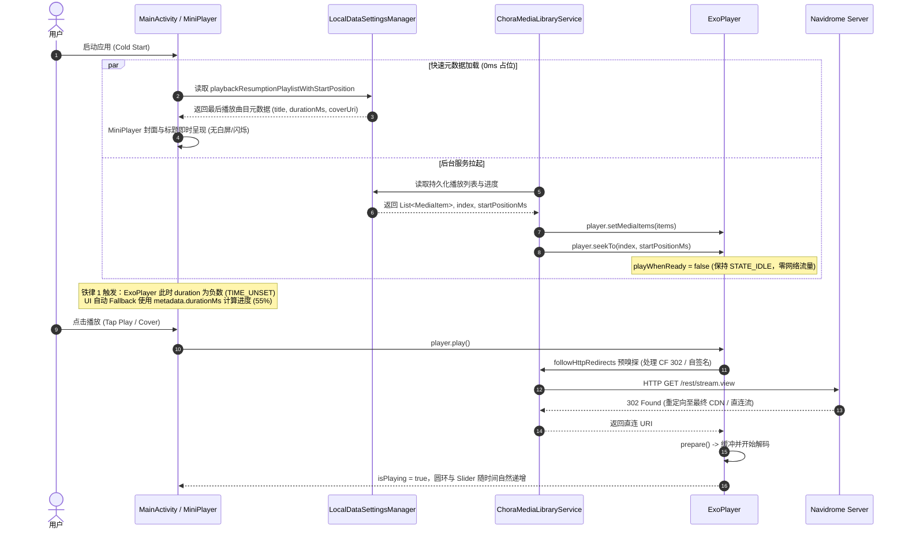

# Chora 架构全景与技术实现手册

本文档面向所有参与 Chora 客户端开发维护的工程师与 AI Agent，全面解析核心数据流、底层播放架构、网络音频嗅探机制以及关键模块交互。

---

## 1. 核心技术栈与拓扑

- **开发语言**：Kotlin 2.0+ (100%)
- **UI 框架**：Jetpack Compose + Material Design 3 (含 Compose Expressive 动效)
- **播放内核**：AndroidX Media3 1.5+ (ExoPlayer + MediaLibraryService + MediaSession)
- **网络与流媒体**：OkHttp3 + Retrofit2 + Subsonic REST 协议 (Navidrome)
- **本地持久化**：Jetpack Preferences DataStore (`LocalDataSettingsManager`, `AppearanceSettingsManager`)
- **图片加载与色彩提取**：Coil 2.x + AndroidX Palette (动态模糊与自适应背景色)
- **TV 端适配**：AndroidX Compose for TV (D-Pad 十字键焦点控制)

---

## 2. 播放状态机与冷启动续播架构 (Resumption Dataflow)



---

## 3. 核心机制深入解析

### 3.1 进度计算与多级 Fallback 防御体系
冷启动恢复或未缓冲阶段，ExoPlayer 处于 `Player.STATE_IDLE`，此时调用 `player.duration` 将返回 `C.TIME_UNSET`（负大数）。

```kotlin
// 1. 从 MediaMetadata 提取安全时长
val metaDurationMs = remember(metadata) {
    val ms = metadata?.durationMs ?: 0L
    if (ms > 0L) ms
    else (metadata?.extras?.getLong("duration")?.takeIf { it > 0 }?.times(1000L)) ?: 0L
}

// 2. 多级有效时长计算
val effectiveDuration = when {
    duration > 1000L -> duration
    metaDurationMs > 1000L -> metaDurationMs
    else -> 0L
}

// 3. 安全比例计算 (分母为 0 时安全落至 0f，严禁单纯 coerceAtLeast(1L))
val progress = if (effectiveDuration > 0L) {
    (currentPosition.toFloat() / effectiveDuration.toFloat()).coerceIn(0f, 1f)
} else {
    0f
}
```

### 3.2 Cloudflare / 反向代理 302 嗅探机制 (`followHttpRedirects`)
在某些公网部署（如使用 Cloudflare Tunnel、双重域名、反向代理端口映射）中，Subsonic 流请求返回 `302 Found` 跳转至其他端口或协议。Android 的默认网络栈安全沙箱会在跨协议跨端口时阻断自动重定向。

- **实现位置**：`ChoraMediaLibraryService.kt`
- **执行逻辑**：在把 URI 交付 ExoPlayer 之前，通过轻量级 `HttpURLConnection` 发送 `HEAD/GET` 探测，若响应码为 `301/302/303/307/308`，解析 `Location` 头并在白名单限制内多级迭代，将最终地址注入 `MediaItem.Uri`。

### 3.3 系统返回键 (BackHandler) 分层控制
在单 Activity 多 Composable 路由体系中，播放器全屏展开态必须优先拦截返回键：
1. **展开态优先**：`enabled = isPlayerExpanded`
   - 若播放队列展开 -> 关闭队列
   - 若歌曲详情展开 -> 关闭详情
   - 否则 -> 平滑执行 `scaffoldState.bottomSheetState.partialExpand()` 折叠为 Mini Player
2. **收起态控制**：`enabled = !isPlayerExpanded`
   - 若当前位于首页 (`Screen.Home.route`) -> 2 秒内双击退出应用并保存持久化状态
   - 若位于其他子页面 -> 正常 `navController.popBackStack()`

---

## 4. 目录结构索引

```
app/src/main/java/com/craftworks/music/
├── MainActivity.kt                      # 全局入口、Scaffold 与多层返回键控制
├── managers/
│   ├── NavidromeManager.kt              # Navidrome 节点发现、测速选路与鉴权
│   ├── settings/
│   │   ├── LocalDataSettingsManager.kt  # 播放历史、歌单续播状态持久化
│   │   └── AppearanceSettingsManager.kt # 界面主题、动效风格配置
├── player/
│   ├── MusicService.kt                  # ChoraMediaLibraryService 核心播放服务
│   └── AudioOutputObserver.kt           # 耳机拔插、蓝牙音频设备路由监听
├── data/
│   ├── model/Song.kt                    # 歌曲模型与 MediaItem/MediaMetadata 互转
│   └── MediaNavidromeProvider.kt        # Navidrome API 交互封装
└── ui/
    ├── playing/
    │   ├── NowPlayingMiniPlayer.kt      # 底部自适应浮层、圆形封面进度环
    │   ├── NowPlayingPortrait.kt        # 竖屏全屏播放、封面歌词双页联动
    │   ├── NowPlayingLandscape.kt       # 横屏分栏全屏播放
    │   └── NowPlayingElements.kt        # 播放控制按钮、滑块组件、歌词视轨
    └── screens/                         # 各功能一级与二级屏幕
```
